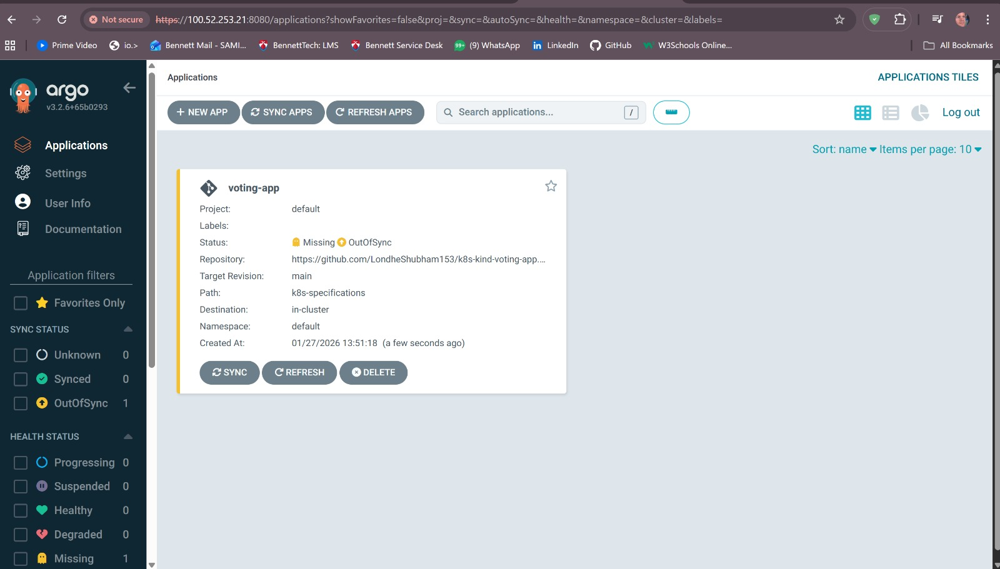
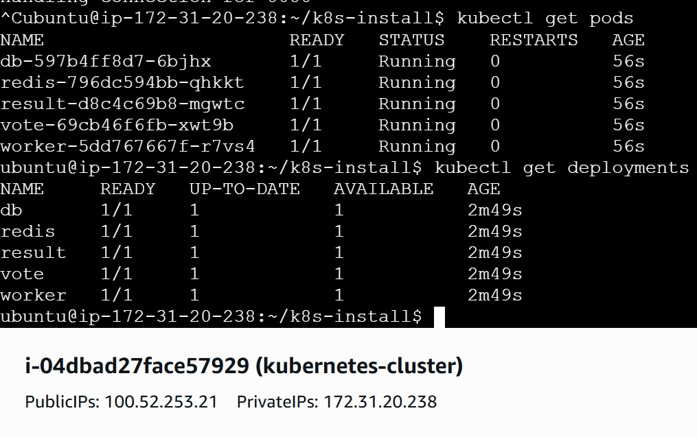

# GitOps-Based Kubernetes Deployment with Argo CD on AWS EC2

## 📌 Project Overview
This project demonstrates an **end-to-end GitOps workflow** where a microservices-based application is deployed and managed on a Kubernetes cluster using **Argo CD**.  
The Kubernetes cluster is created using **KIND (Kubernetes IN Docker)** and hosted on an **AWS EC2 instance**.  
The project also includes **cluster visualization using Kubernetes Dashboard** and external access to services using **NodePort**.

---

## 🛠 Tools & Technologies Used

- **AWS EC2** – Cloud virtual machine to host the environment  
- **Docker** – Container runtime for Kubernetes nodes  
- **KIND** – Lightweight Kubernetes cluster inside Docker  
- **Kubernetes** – Container orchestration platform  
- **kubectl** – CLI to interact with Kubernetes  
- **Argo CD** – GitOps-based continuous deployment tool  
- **Kubernetes Dashboard** – Web UI for cluster monitoring  
- **GitHub** – Source of Kubernetes manifests  

---

## 🔄 Workflow Summary

1. Launch an AWS EC2 instance  
2. Install Docker and Kubernetes tooling  
3. Create a multi-node Kubernetes cluster using KIND  
4. Install and access Argo CD  
5. Deploy a microservices application using GitOps  
6. Expose services externally using NodePort  
7. Monitor the cluster using Kubernetes Dashboard  

---

## ☁️ Infrastructure Setup

### 1. AWS EC2 Instance
- Instance Type: `t2.medium`
- OS: Ubuntu
- Storage: 15 GB
- Security Group configured to allow:
  - Argo CD UI
  - Kubernetes Dashboard
  - NodePort services


---

## 🐳 Docker Installation

```bash
sudo apt-get update
sudo apt-get install docker.io -y
```
Fix Docker permission issue
```bash
sudo usermod -aG docker $USER
newgrp docker
```
---

## ☸️ Kubernetes Cluster Setup using KIND
Install KIND
Script used: scripts/install_kind.sh

to make .sh file executable.
```bash
chmod +x install_kind.sh
./install_kind.sh
```
---

## Create Kubernetes Cluster
Configuration file: kubernetes/kind-cluster-config.yaml

```bash
kind create cluster --name my-cluster --config kind-cluster-config.yaml
```


All Kubernetes nodes in Ready state

---
## 🧰 Install kubectl

Script used: scripts/install_kubectl.sh

---

##  Argo CD Installation
```bash
kubectl create namespace argocd
kubectl apply -n argocd -f \
https://raw.githubusercontent.com/argoproj/argo-cd/stable/manifests/install.yaml
```
Access Argo CD UI
```bash
kubectl port-forward -n argocd svc/argocd-server 8080:80 --address=0.0.0.0 &
```
Get admin password:
```bash
kubectl -n argocd get secret argocd-initial-admin-secret \
-o jsonpath="{.data.password}" | base64 -d
```

---
## GitOps Application Deployment
Create New Application in Argo CD

- Repository: https://github.com/LondheShubham153/k8s-kind-voting-app.git
- Path: k8s-specifications
- Namespace: default


- creating new application on argocd
- path where k8s manifest file is stored
- source code should be deployed on our cluster


---
## Sync Application

Click SYNC in Argo CD UI.

This deploys:
- vote
- result
- worker
- redis
- postgres


### Verify Kubernetes Resources
```bash
kubectl get pods
kubectl get deployments
```

---
## 🌐 Service Exposure (NodePort)

NodePorts assigned:
Access voting app UI
```bash
kubectl port-forward svc/vote 5000:5000 --address=0.0.0.0 &
```

```bash
kubectl port-forward svc/vote 5000:5000 --address=0.0.0.0 &

```
Vote App → 5000
Result App → 5001

Access URLs:

http://<EC2_PUBLIC_IP>:5000
http://<EC2_PUBLIC_IP>:5001


Voting dashboard

Result dashboard (live updates)


---

## 📊 Kubernetes Dashboard Setup
Install Dashboard
```bash
kubectl apply -f \
https://raw.githubusercontent.com/kubernetes/dashboard/v2.7.0/aio/deploy/recommended.yaml
```

Create Admin User (RBAC)

File: kubernetes/k8s-dashboard-admin.yaml

```bash
kubectl apply -f k8s-dashboard-admin.yaml
kubectl -n kubernetes-dashboard create token admin-user
``` 

Access Dashboard
```bash
kubectl port-forward -n kubernetes-dashboard svc/kubernetes-dashboard 8444:443 --address=0.0.0.0 &
```

Access:
https://<EC2_PUBLIC_IP>:8444


---

## ✅ Final Outcome

- Multi-node Kubernetes cluster running on AWS EC2
- GitOps-based deployment using Argo CD
- Microservices application deployed successfully
- External access via NodePort
- Cluster monitoring using Kubernetes Dashboard