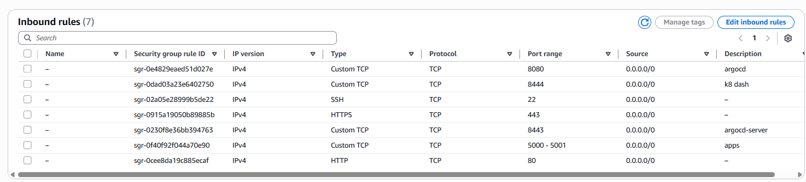
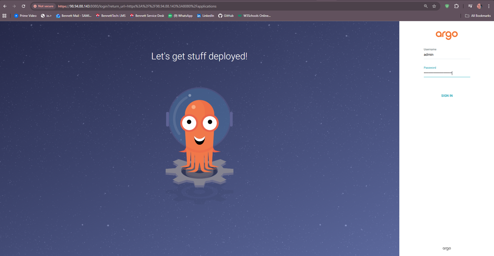
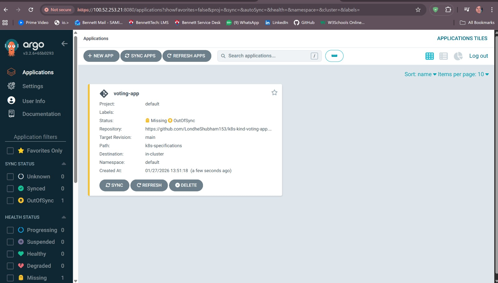
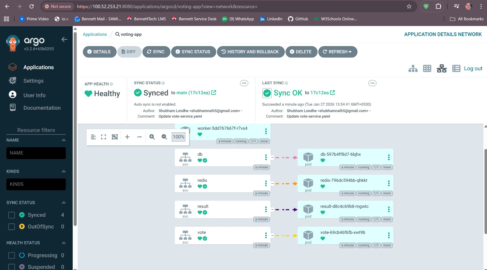
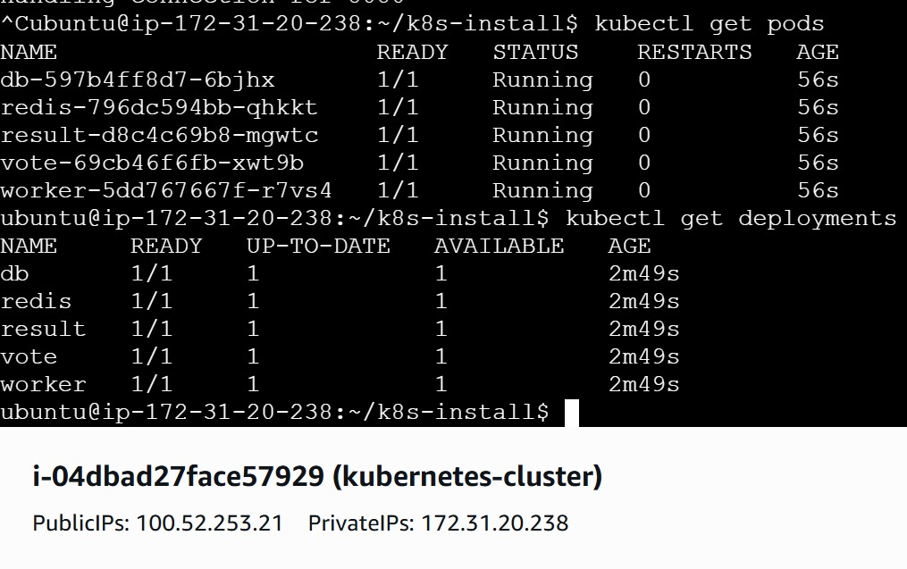
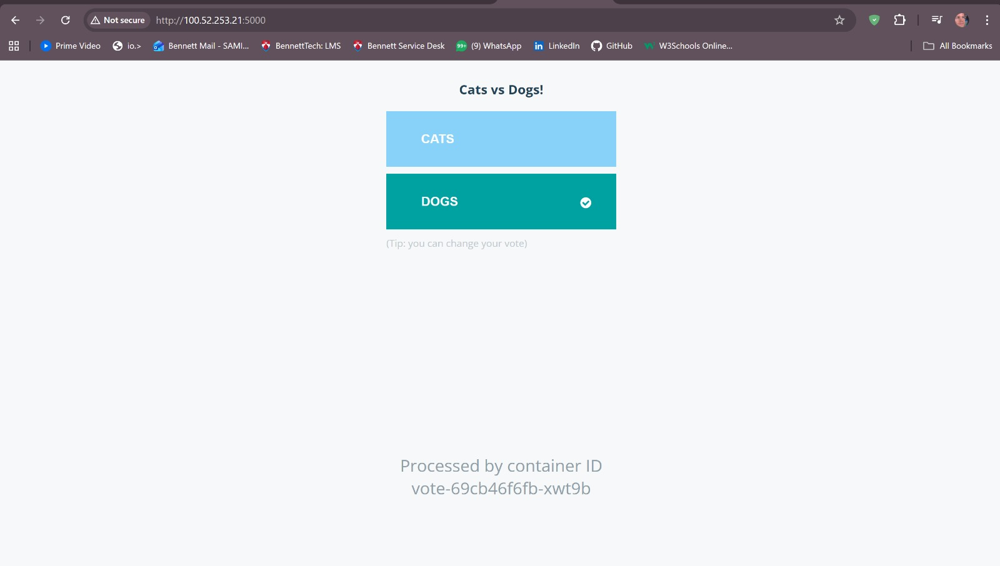
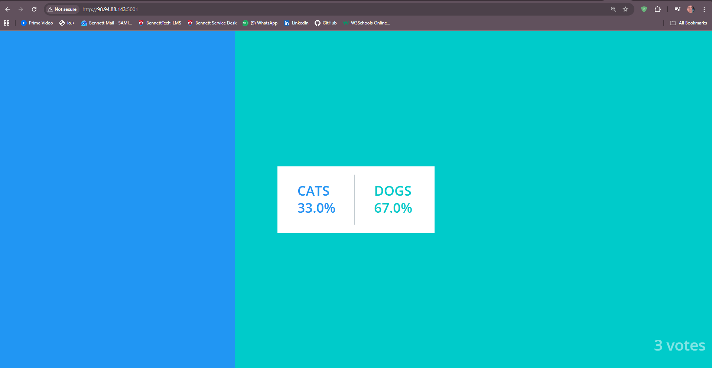
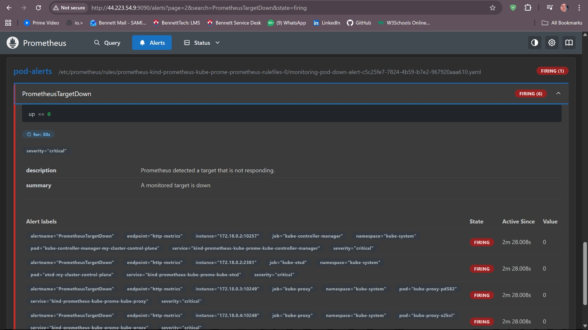

# GitOps-Based Kubernetes Deployment with Argo CD on AWS EC2

## 📌 Project Overview

This project demonstrates an end-to-end application deployment workflow using **Argo CD** on a Kubernetes cluster hosted on **AWS EC2**. A multi-node Kubernetes cluster is created using **KIND (Kubernetes in Docker)** to deploy a microservices-based voting application. The project also includes real-time **cluster monitoring using Kubernetes Dashboard** and external service access for application interaction.

---

## 🛠 Tools & Technologies Used

- **AWS EC2** – Cloud virtual machine to host the environment  
- **Docker** – Container runtime for Kubernetes nodes  
- **KIND** – Lightweight Kubernetes cluster inside Docker  
- **Kubernetes** – Container orchestration platform  
- **kubectl** – CLI to interact with Kubernetes  
- **Argo CD** – GitOps-based continuous deployment tool  
- Kubernetes Dashboard – Web UI for cluster monitoring
- Prometheus – Metrics collection and monitoring system
- Grafana – Visualization dashboards for cluster metrics
- GitHub – Source of Kubernetes manifests 

---

## 🔄 Workflow Summary

1. Launch an AWS EC2 instance  
2. Install Docker and Kubernetes tooling  
3. Create a multi-node Kubernetes cluster using KIND  
4. Install and access Argo CD  
5. Deploy a microservices application using GitOps  
6. Expose services externally using NodePort  
7. Monitor cluster health using Kubernetes Dashboard
8. Install Prometheus and Grafana using Helm
9. Configure Prometheus alert rules to detect failures 

---

## ☁️ Infrastructure Setup

### 1. AWS EC2 Instance
- Instance Type: `t2.medium`
- OS: Ubuntu
- Storage: 15 GB
- Security Group configured to allow:
  - Argo CD UI
  - Kubernetes Dashboard
  - NodePort services



---

## 🐳 Docker Installation

```bash
sudo apt-get update
sudo apt-get install docker.io -y
```
Fix Docker permission issue
```bash
sudo usermod -aG docker $USER && newgrp docker
```
---

## ☸️ Kubernetes Cluster Setup using KIND
Install KIND
Script used: scripts/install_kind.sh

to make the script executable and run it:
```bash
chmod +x install_kind.sh
./install_kind.sh
```
---

## Create Kubernetes Cluster
Configuration file: kubernetes/kind-cluster-config.yaml

```bash
kind create cluster --name my-cluster --config kind-cluster-config.yaml
```


All Kubernetes nodes in Ready state

---
## 🧰 Install kubectl

Script used: scripts/install_kubectl.sh

---

##  Argo CD Installation
```bash
kubectl create namespace argocd
kubectl apply -n argocd -f \
https://raw.githubusercontent.com/argoproj/argo-cd/stable/manifests/install.yaml
```
Access Argo CD UI
```bash
kubectl port-forward -n argocd svc/argocd-server 8080:80 --address=0.0.0.0 &
```
Get admin password:
```bash
kubectl -n argocd get secret argocd-initial-admin-secret \
-o jsonpath="{.data.password}" | base64 -d
```

---
## GitOps Application Deployment
Create New Application in Argo CD

- Repository: https://github.com/LondheShubham153/k8s-kind-voting-app.git
- Path: k8s-specifications
- Namespace: default
- creating new application on argocd
- path where Kubernetes manifests (YAML files) is stored <https://github.com/LondheShubham153/k8s-kind-voting-app/tree/main/k8s-specifications>
- The Kubernetes manifests stored in the repository are automatically deployed to the cluster using Argo CD.



---
## Sync Application

Click SYNC in Argo CD UI.

This deploys:
- vote
- result
- worker
- redis
- postgres



### Verify Kubernetes Resources
```bash
kubectl get pods
kubectl get deployments
```

---
## 🌐 Service Access

Services are accessed externally using `kubectl port-forward` for demonstration purposes.

Access the Voting Application UI
```bash
kubectl port-forward svc/vote 5000:5000 --address=0.0.0.0 &
```

```bash
kubectl port-forward svc/result 5001:80 --address=0.0.0.0 &
```
Vote App → http://<EC2_PUBLIC_IP>:5000
Result App → http://<EC2_PUBLIC_IP>:5001

Voting dashboard

Result dashboard (live updates)


---

## 📊 Kubernetes Dashboard Setup
Install Dashboard
```bash
kubectl apply -f \
https://raw.githubusercontent.com/kubernetes/dashboard/v2.7.0/aio/deploy/recommended.yaml
```

Create Admin User (RBAC)

File: kubernetes/k8s-dashboard-admin.yaml

```bash
kubectl apply -f k8s-dashboard-admin.yaml
kubectl -n kubernetes-dashboard create token admin-user
``` 

Access Dashboard
```bash
kubectl port-forward -n kubernetes-dashboard svc/kubernetes-dashboard 8444:443 --address=0.0.0.0 &
```

Access:
https://<EC2_PUBLIC_IP>:8444


---

## 📈 Monitoring with Prometheus and Grafana

To monitor cluster health and resource usage, the **kube-prometheus-stack** Helm chart was installed.  
This stack includes **Prometheus** for metrics collection and **Grafana** for visualization dashboards.

### Install Helm

```bash
curl -fsSL -o get_helm.sh https://raw.githubusercontent.com/helm/helm/main/scripts/get-helm-3
chmod +x get_helm.sh
./get_helm.sh
```
### Add Helm Repositories
```bash
helm repo add prometheus-community https://prometheus-community.github.io/helm-charts
helm repo update
```
### Create Monitoring Namespace
```bash
kubectl create namespace monitoring
```
### Install kube-prometheus-stack
```bash
helm install kind-prometheus prometheus-community/kube-prometheus-stack \
--namespace monitoring
```
This installs the following monitoring components:
- Prometheus – collects cluster metrics
- Grafana – provides visualization dashboards
- Alertmanager – processes alerts generated by Prometheus
- Node Exporter – exposes node-level metrics
---
## 📊 Grafana Dashboard

Grafana provides pre-configured dashboards to visualize Kubernetes cluster metrics such as CPU usage, memory usage, and pod performance.


Access Grafana using port forwarding:
```bash
kubectl port-forward svc/kind-prometheus-grafana -n monitoring 3000:80 --address=0.0.0.0 &
```
Access Grafana UI:
```bash
http://<EC2_PUBLIC_IP>:3000
```

Default login:
```bash
Username: admin
Password: retrieved from Kubernetes secret
```

---

## 🚨 Prometheus Alert Rule

Prometheus alert rules were configured to detect service failures in monitored targets.
Example alert rule condition:

expr: up == 0

- This rule triggers an alert when a monitored target becomes unavailable.
- When the condition is met, the alert enters a **FIRING** state in Prometheus.


#### The full alert configuration can be found in:
#### kubernetes/pod-alert.yaml

---
## ✅ Final Outcome

- Multi-node Kubernetes cluster running on AWS EC2  
- Automated application deployment using Argo CD  
- Successfully deployed a microservices-based application  
- Enabled external access to services using NodePort  
- Implemented cluster monitoring using Kubernetes Dashboard  
- Implemented cluster monitoring using Prometheus and Grafana
- Configured Prometheus alert rules to detect service failures


